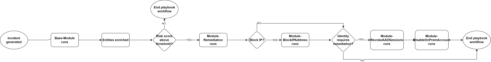

# Automated Triage

This repository contains a set of playbooks designed to facilitate automated triage and response of Microsoft Sentinel incidents. This is built off of the existing [Microsoft Sentinel Triage AssistanT (STAT)](https://github.com/briandelmsft/SentinelAutomationModules/tree/main) project, and adds additional modules that enable actions such as disabling a user or revoking login sessions.

## Core concepts

The workflow starts with a modified version of the STAT base module playbook. The base module will perform enrichment activities for identified entities. Similar to STAT, a risk score is tracked throughout the lifecycle of the playbook run. The risk score threshold determines when response actions are required.

The Module-DisableOnPremUser playbook works by running a simple PowerShell script on a system with the Hybrid Worker installed. This will disable the user in Active Directory.

The diagram below describes the basic flow of the workbooks:

## Included playbooks

| Playbook Name | Description | 
| ---------| -----------|
|Base-Module | A modified version of the [STAT Base Module](https://github.com/briandelmsft/SentinelAutomationModules/tree/main/Modules/BaseModule) that enriches entities associated with the security incident|
|Module-EnrichIPAddress | this module enriches IP address entities with information from ip-api and AbuseIPDB|
|Module-RiskScoring | this module calculates the final overall risk score of the incident|
|Module-Remediation | this module notifies incident response teams to approve response actions|
|Module-BlockIPAddress|this module performs the necessary tasks to block an IP address in Azure Conditional Access |
|Module-RevokeAADSessions | this module performs the necessary tasks to revoke a users Entra ID sessions|
|Module-DisableOnPremUser| this module facilities disabling an on-prem Active Directory user via Azure Automation. This module is for organizations that have not implemented password writeback with Microsoft Entra Connect.|

# Deployment

### Deploy all templates
To deploy all playbooks as installable templates in your Microsoft Sentinel instance, use the following Deploy to Azure buttons:

### Deploy playbooks individually
Each playbook has its own separate directory and assocaited deployment template and button.
